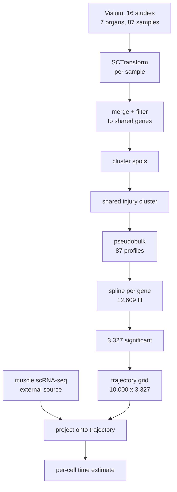

# REMODEL Pipeline&#32;

## Summary

The pipeline assigns each cell in a single-cell RNA-seq dataset an estimated time since injury, by projecting it onto a reference expression trajectory fit to spatial transcriptomics data from seven organs.

The reference trajectory is derived from Visium spatial transcriptomics of 16 published mouse injury studies covering brain, heart, kidney, liver, lung, muscle and skin, each using the injury model conventional for its organ: 87 Visium samples in total, 24 of them uninjured or sham controls. Spots from all studies were normalised, merged and clustered; one cluster present in all seven organs was taken to represent a shared injury response. Spots in that cluster were averaged within each Visium sample, giving 87 pseudobulk profiles spanning 0 to 336 h post-injury. For each of 12,609 genes, a natural cubic spline in log-time plus an organ offset was fit to these 87 points, and the 3,327 genes with a significant time effect were evaluated on a 10,000-point grid to give the reference trajectory.

Separately, dissociated single-cell RNA-seq of injured mouse muscle was obtained from an external source. To date these cells, the trajectory was reduced to two principal components, each cell was placed in the same coordinate frame, and each cell was assigned the time of the nearest trajectory point.

The two data streams differ in measurement modality. The trajectory is built from Visium spots, each covering roughly 1–10 cells of mixed type at 55 μm resolution, normalised with `SCTransform`. The query data are dissociated single cells normalised by log counts-per-10,000. The projection assumes the two are comparable after mean-centring.

Single-cell data from the same 16 studies were also used in a parallel branch to deconvolve Visium spot composition with `cell2location`. That branch supports a separate cell-type-abundance analysis and does not feed the gene-level trajectory described here.

| Term | Definition as used here |
| --- | --- |
| Visium | 10x Genomics spatial transcriptomics; measures expression in 55 μm spots on a tissue section, each spot containing several cells |
| scRNA-seq | Single-cell RNA sequencing of dissociated tissue; one profile per cell |
| Pseudobulk | Mean expression across all spots or cells in one sample, giving one profile per sample |
| Natural cubic spline | A piecewise-cubic curve constrained to be linear beyond the outermost knots, used here to model expression against time |
| Projection | Placing new observations into a coordinate frame defined by the trajectory and locating the nearest trajectory point |

## Data sources

Input data is Visium spatial transcriptomics from 16 published mouse injury studies, downloaded as 10x Genomics feature-barcode matrices or as author-provided Seurat objects. Each study occupies a directory named `<first-author>-<organ>/`, holding the downloaded files, a setup notebook and a per-study Seurat object `<study>-vis.RDS`.

After processing, each Visium sample contributes one pseudobulk profile. The 87 profiles below are the complete evidence base for the trajectory, recorded exactly in `tmp/model-data-shape.RDA`. Of the 87, 24 are uninjured or sham controls and 63 are injured.

| Organ | Study | Samples | Control / injured | Timepoints (h) | Injury model as recorded in the repository |
| --- | --- | --: | --- | --- | --- |
| brain | han-brain | 2 | 1 sham / 1 | 0, 48 | not recorded; samples named `sham` and `2d` |
| brain | scott-brain | 3 | 1 sham / 2 | 0, 48, 240 | not recorded |
| brain | zucha-brain | 2 | 0 / 2 | 24, 72 | not recorded |
| heart | calcagno-heart | 10 | 2 sham / 8 | 0, 1, 4, 72, 168 | myocardial infarction; files `V_sham_Np`, `V_d7`, `V_Human_STEMI` |
| heart | jung-heart | 3 | 0 / 3 | 24, 72, 168 | myocardial infarction; files `VISIUM_Day1_post-MI` etc. |
| heart | yamada-heart | 10 | 1 sham / 9 | 0, 24, 168, 336 | myocardial infarction; samples `WT_Sham`, `WT_MI_day1/7/14` |
| kidney | dixon-kidney | 4 | 1 sham / 3 | 0, 4, 12, 48 | not recorded; sham plus `f4hr`, `f12hr`, `f2dps`, `f6wks` |
| kidney | michael-kidney | 2 | 1 sham / 1 | 0, 6 | ischaemia-reperfusion; `iri` in the setup notebook |
| liver | ben-mosche-liver | 6 | 0 / 6 | 24, 48, 72 | acetaminophen overdose; `apap-sc-matrix.rds` |
| liver | guilliams-liver | 4 | 4 uninjured / 0 | 0 | none; uninjured liver only |
| liver | matchett-liver | 11 | 3 non-injured / 8 | 0, 24, 36, 48 | not recorded; samples `hea*` (healthy) vs `pod*` |
| lung | franzen-lung | 15 | 6 sham / 9 | 0, 168 | not recorded |
| muscle | heezen-muscle | 2 | 2 uninjured / 0 | 0 | none; strain baselines C57BL/6J and DBA/2J |
| muscle | larouche-muscle | 6 | 0 / 6 | 168, 336 | volumetric muscle loss; `vml` and `notexin` in notebooks, GSE163376 `vml_cca` |
| skin | foster-skin | 4 | 1 uninjured / 3 | 0, 48, 168, 336 | not recorded; wound time course |
| skin | konieczny-skin | 3 | 1 unwounded / 2 | 0, 72 | wounding; samples `WT_UNWO`, `WT_WO_1`, `WT_WO_2` |

Injury model is documented for six of the 16 studies, and only through sample or file naming rather than any explicit annotation. For the remaining ten the model must be obtained from the original publication. The `injured` field in `model.data` distinguishes control from injured but uses four labels for the control condition — `Sham`, `Uninjured`, `Non-injured` and, in injured rows, `Injured`. That field is not used by the model.

Sample counts per study range from 2 to 15, and the distribution is not balanced against biological interest: `franzen-lung` contributes 15 samples at two timepoints, while `dixon-kidney` contributes 4 across four timepoints. The `1/n` weighting at the modelling stage compensates for this within each organ-timepoint group but not across studies.

| Study | Source data as recorded |
| --- | --- |
| han-brain | directory absent; setup notebook only |
| scott-brain | `d2-spatial/`, `d10-spatial/`, `d21-spatial/` |
| zucha-brain | directory absent; setup notebook only |
| calcagno-heart | GSM6613081, GSM6613087, GSM6613090; `V_1hr/`, `V_4hr/` |
| jung-heart | GSM4972357–60; GSM5051464–67 |
| yamada-heart | `GSE176092_RAW.tar`; GSM5355663/66/68, GSM5943189–95 |
| dixon-kidney | `fsham_137`, `f4hr_115`, `f12hr_140`, `f2dps_158` |
| michael-kidney | `rawdata/` |
| ben-mosche-liver | `0h_24h.h5`, `48a`, `48b`, `72`, `96`, `96_1w` |
| guilliams-liver | GSM5764414–17 |
| matchett-liver | `rawdata/` |
| franzen-lung | `mm_visium_all_stutility_obj.rds`; V10A20-052/053/071–074 |
| heezen-muscle | `C57BL10_relabellednew.rds`, `DBA2J_relabellednew.rds` |
| larouche-muscle | GSE163376, GSE205707, GSE232106, GSE162172 |
| foster-skin | GSM6443210–13 |
| konieczny-skin | GSM5089667–69 |

Two studies are no longer present. The `han-brain` and `zucha-brain` directories do not exist; only their setup notebooks survive in `notebooks/`. Together they contributed 4 of the 87 samples. Two further per-study objects, `franzen-lung-vis.RDS` and `matchett-liver-vis.RDS`, currently read 0 bytes and may not have finished downloading.

The injury models differ fundamentally across organs. Where recorded they span ischaemic injury (myocardial infarction in all three heart studies, ischaemia-reperfusion in kidney), toxic injury (acetaminophen overdose in liver), and mechanical injury (volumetric muscle loss in muscle, excisional wounding in skin). The shared-time model treats the response to these as one time course differing only by an organ-level constant. That is the pipeline's central premise rather than an incidental detail: it asserts that a heart recovering from infarction and a muscle recovering from tissue excision pass through comparable transcriptional states on comparable schedules.

Temporal coverage is uneven, and muscle is the worst-covered organ despite being the one the trajectory is applied to. Its 8 samples comprise two uninjured baselines from `heezen-muscle` and six injured samples at days 7 and 14 from `larouche-muscle`, with nothing in between. The trajectory's shape across the first week is determined by heart, liver, kidney and brain.

Muscle is also the only organ whose baseline and injured samples come from different studies. Every other organ has at least one study contributing both a control and an injured sample, so within-study differences can be distinguished from time. For muscle they cannot: any batch difference between `heezen-muscle` and `larouche-muscle` — different laboratories, different Visium runs, different mouse strains, and an uninjured baseline against a volumetric-muscle-loss model — is absorbed into the estimated time effect rather than into the organ offset. Four other studies (`zucha-brain`, `jung-heart`, `ben-mosche-liver`, `larouche-muscle`, 17 samples in total) likewise contribute no internal control.

Single-cell RNA-seq from the same studies was also collected, stored as `<study>-sc.RDS`, and used to build cell-type references for `cell2location` deconvolution of the Visium spots. Those results feed a separate cell-type-abundance analysis (`GAM-celltype-deconv.ipynb`) and not the trajectory.

## Processing the Visium data

### Per study

Each study was loaded in its own `<study>-setup.ipynb` or `<study>Vis.ipynb` notebook. Feature-barcode matrices were read with `Seurat::Load10X_Spatial()`; four studies supplied author-processed Seurat objects instead and were read directly with `readRDS()`. Spot coordinates were retained as `x` and `y` in the metadata, and each sample was labelled with `study`, `replicate`, `tissue`, `timepoint` and `injured`.

Normalisation was performed by `scTransform()` in `functions.r`, which applies three operations:

1. Spots with fewer than 500 detected genes are removed.
2. The object is split by `replicate` and `SCTransform()` is run on each separately, with `method = "glmGamPoi"`, `scale_factor = 2133`, `return.only.var.genes = FALSE` and `min_cells = 0`.
3. The normalised replicates are merged.

Running `SCTransform` per replicate rather than across the whole object means each Visium sample receives its own variance-stabilising fit. This substitutes for an explicit batch-correction step. The `scale_factor` of 2133 is not the Seurat default and its origin is not documented.

### Merging the studies

`VisAssemble.ipynb` reads the 16 per-study objects, appends `__<study>` to every spot barcode to guarantee uniqueness, merges them, applies the 500-gene filter again after `JoinLayers()`, and writes `20240903_master.RDS`.

`notebooks/Preprocessing.ipynb` then reduces the merged object to a shared feature space:

1. Missing `nFeature_RNA` values are backfilled from `nFeature_Spatial`, and `timepoint` is patched for the `1h` and `4h` replicates.
2. `SelectIntegrationFeatures()` selects 1,500 features across tissues.
3. Of those, only features detected in more than 3% of spots in all seven organs are retained.
4. `RunPCA(npcs = 100)` is computed on the retained features.
5. `RunUMAP(dims = 1:35, min.dist = 0.3, metric = "cosine", seed.use = 10000)`.
6. `FindNeighbors(dims = 1:20, annoy.metric = "cosine")` followed by `FindClusters(resolution = 0.16, algorithm = 4, method = "igraph")`, i.e. Leiden clustering.

Step 3 is what permits a single clustering across organs, and it also restricts the feature space to broadly and abundantly expressed genes. The same restriction propagates to the trajectory and to the projection.

No batch-correction algorithm was applied on this path. Harmony appears in the repository and in the metadata of externally supplied objects, but not in the lineage that produces the models. Comparability between studies rests on per-replicate `SCTransform` and the cross-organ feature filter.

## The query data

The cells to be dated are dissociated single cells from injured mouse muscle, supplied as finished `.h5ad` files in `MuscleObjects/`. They were not produced by any code in this repository and share no processing steps with the Visium data above.

Files are split by lineage — macrophages, dendritic cells, T cells, muscle stem cells, endothelial cells, fibroblasts — with separate young, aged and combined versions of each. Sample metadata records six timepoints (0, 24, 48, 84, 120 and 168 h) under `Time.Point`, a single `orig.ident` value of `mouse_muscle`, and age and sex annotations.

Each file stores two expression matrices:

| Slot | Dimensions | Contents |
| --- | --- | --- |
| `X` | 7,312 × 2,000 | `ScaleData` output on variable features, clipped at 10; range −4.26 to 10.0 |
| `raw.X` | 7,312 × 31,053 | All genes, log-normalised; used by the projection |

Dimensions are given for `walter_dc.h5ad`. Reversing the log transform on `raw.X` gives per-cell totals of exactly 10,000, confirming `LogNormalize` with a scale factor of 10,000. The projection reads `raw.X` only.

Processing history is recorded in the object metadata and is distinct from the Visium pipeline: `soupx.rho` and `soupx.used` from SoupX ambient-RNA correction, `DF.individual` and `DF.pANN.individual` from DoubletFinder, `harmony_snn_res.0.8` from Harmony integration, `Specific_cell_types` annotations, and eleven senescence scores including SenMayo, GO.SASP and FBR. Conversion from Seurat used `SeuratDisk::SaveH5Seurat()` followed by `Convert(dest = "h5ad", assay = "RNA")`, and the `.h5Seurat` intermediates remain alongside the `.h5ad` files.

The query and reference data differ in two respects at once. They are different measurement modalities: Visium spots integrate transcripts from several cells within a 55 μm area of intact tissue, whereas single-cell data measure individual dissociated cells. They are also differently normalised: `SCTransform` regularised negative binomial residuals against log counts-per-10,000. The projection centres each matrix on its own gene means before computing coordinates, which removes any constant offset between the two scales but does not reconcile the difference in variance structure, nor the difference between a spot-level and a cell-level measurement. Neither discrepancy has been quantified.

## Fitting the trajectory

Model fitting is implemented in `20241115_moduleselection.ipynb`. Five near-identical copies exist elsewhere in the repository; they differ only in plotting.

One Leiden cluster, present in spots from all seven organs, was taken to represent the shared injury response, and only spots assigned to it were used. The cluster's numeric identity is not recorded in any surviving notebook.

Expression from the SCT `data` layer was averaged across those spots within each combination of `replicate`, `study`, `timepoint` and `tissue`, giving the 87 pseudobulk profiles. Each profile was weighted by `1/n` within its `tissue × timepoint` group, so that organs with many replicates at one timepoint do not dominate. Time entered the model as `timepoint_log = log(1 + hours)`.

Genes were restricted to those detected in more than 3% of injury-cluster spots in every organ, giving 12,609 genes. For each, three models were fit with `mgcv::gam()` and the sample weights above:

| Model | Formula | Purpose |
| --- | --- | --- |
| Null | `gene ~ tissue` | Organ offsets, no time dependence |
| Shared-time | `gene ~ ns(timepoint_log, df = 4) + tissue` | Exported as the trajectory |
| Organ-specific | `gene ~ ns(timepoint_log, df = 4) + tissue*bs(timepoint_log, degree = 1, df = 2) + tissue` | Tests organ-specific timing |

Likelihood-ratio tests were computed with `lmtest::lrtest()`: shared-time against null gives `pval_time`, and organ-specific against shared-time gives `pval_tissue`. Only `pval_time` is used downstream.

The exported model treats organ identity as an additive offset, so every organ shares one time course differing only in baseline. This is the pipeline's central assumption, and the organ-specific model exists to test it per gene rather than to replace it. The natural cubic spline has four degrees of freedom, with boundary knots at `log(1)` and `log(337)` and interior knots at 0.486, 3.892 and 5.130 on the log-time scale.

P-values were adjusted with `p.adjust()` called without a method argument, which defaults to Holm, not Benjamini-Hochberg. Holm controls the family-wise error rate — the probability of any false positive across the 12,609 tests — whereas Benjamini-Hochberg controls the expected proportion of false positives among genes declared significant. Holm is the more conservative choice at this scale, and it determines how many genes enter the trajectory.

Applying a threshold of adjusted p < 0.001 retains 3,327 of the 12,609 genes, a count verified against `curr_modules.RDS`. These genes define the trajectory. All 12,609 fitted models are stored in `tmp/spline-models-cluster.RDA`; the companion `tmp/spline-models-noncluster.RDA` holds equivalent fits for spots outside the injury cluster and is not used here.

## Exporting the trajectory

`K99figures/export-spline-models.ipynb` evaluates the fitted splines on a dense time grid and writes the result as a matrix. The function `export_muscle_ns_grid()` was called with `min_time = 0`, `max_time = 14*24`, `n_grid = 10000`, `reference_tissue = "muscle"` and `output_prefix = "../tmp/spline-models-export"`.

The grid is `log(seq(min_time + 1, max_time + 1, length.out = n_grid))`, that is, 10,000 points spaced evenly in hours from 0 to 336 and then log-transformed. An alternative spacing, even in log-time, appears commented out immediately above; it would have concentrated resolution in the first hours. Each gene's curve was evaluated with `predict(type = "response", se.fit = TRUE)`, and three files were written: the fitted values, their standard errors, and gene names with model class.

Genes were selected as `rownames(modules)[modules$pval_time_adj < 1e-3]`. A preceding line selecting on module membership is overwritten and has no effect; both criteria happen to yield the same 3,327 genes.

The upper limit of 336 h coincides with the latest sampled timepoint, so the curve is never extrapolated beyond the data. Because `tissue` enters additively, setting `reference_tissue` to muscle shifts each gene's intercept but changes nothing downstream: the projection subtracts each gene's mean across the grid before computing components. The output is therefore invariant to this argument.

Ten thousand grid points exceed what a four-degree-of-freedom spline can resolve; adjacent rows are nearly identical. The grid size also sets the cost of the nearest-point search in the projection, which compares every cell against all 10,000 points.

Both exported matrices initially appeared to be missing, reading 0 bytes. They were Dropbox placeholders that had not yet downloaded, and subsequently materialised at 615 MB and 647 MB with contents intact. The same applied to 26 files in `MuscleObjects/`. Zero-byte files in this repository should be checked for download status before being treated as lost.

Before this was established, the matrices were reconstructed from `tmp/spline-models-cluster.RDA` by `cellprojection/regenerate_fit_matrix.R`. Since all genes share knots and coefficient structure, the script builds the design matrix once and computes all 3,327 predictions in a single matrix product, verifying agreement with `predict.gam` before writing. Reconstruction and original agree to within 6 × 10⁻¹⁵, and the projection returns identical results from either. The script remains useful for regenerating the matrix on a different grid or gene set without refitting.

## Projecting cells onto the trajectory

`cellprojection/CellProjection-v3.ipynb` implements the projection in the function `project_to_trajectory()`. The 10,000 grid rows form a path through gene-expression space; each cell is placed in the same space and assigned the time of the nearest path point.

Trajectory genes were matched against `adata.raw.var_names`, giving 3,325 of 3,327. Genes were then filtered on mean expression above 0.7 and on `var/mean` above 0.5, retaining 310 genes for the macrophage run and 256 for dendritic cells.

The trajectory matrix and the cell matrix were each centred on their own column means. Principal components were computed on the centred trajectory with `sklearn.decomposition.PCA`, and cells were projected onto those components. Two components were retained, capturing 61.6% and 32.0% of trajectory variance in the macrophage run. These percentages describe the curvature of the trajectory, not variance among cells.

Sequencing depth was regressed out of the cell coordinates by ordinary least squares on mean-centred `nFeature_RNA`, preserving the grand mean. This removed 44.2% of PC1 and 25.5% of PC2 variance in the macrophage run. The trajectory coordinates were not adjusted.

An activation score was defined as the Euclidean distance from the trajectory's t = 0 point, divided by the greatest such distance along the trajectory. A two-component Gaussian mixture (`sklearn.mixture.GaussianMixture`, `random_state = 42`) was fit to these scores and the higher-mean component labelled responding. In the macrophage run the components had means 0.558 and 1.078, splitting 20,579 against 14,721 cells.

Squared distances from every cell to every grid point were computed by expansion, and each cell assigned the time of its minimum. Estimated times were converted back as `exp(t) - 1`.

A normalised residual was defined as the squared distance to the nearest trajectory point divided by the squared distance from t = 0. Because t = 0 lies on the trajectory, the triangle inequality bounds this quantity in \[0, 1\]: 0 indicates a cell whose displacement from baseline is fully explained by its trajectory position, 1 indicates none of it is. An optional percentile filter on this residual is available and was set to 100, which excludes nothing.

Estimated times were written only for cells classified as responding; all other cells receive `NaN`. Seven columns were added to the object — `traj_days`, `traj_hours`, `traj_activation`, `traj_residual`, `on_trajectory`, `is_regenerating`, `p_regenerating` — and exported to CSV with cell barcodes, retained components and selected metadata. A nine-panel figure reports the cells in trajectory space, the activation mixture, estimated against known time, and residuals by timepoint and replicate.

Two details affect interpretation. Centring the cells on their own means fixes the centroid of the cell population at the centroid of the trajectory, so the method cannot detect that a population sits systematically off the trajectory; it reports position along it only. The standard errors exported alongside the trajectory are read by the notebook and never used.

## Parameters and software

### Parameters

| Stage | Parameter | Value | Set in |
| --- | --- | --- | --- |
| Per-study QC | minimum genes per spot | 500 | `functions.r::scTransform` |
| Normalisation | method | `SCTransform`, `glmGamPoi`, per replicate | `functions.r::scTransform` |
| Normalisation | `scale_factor` | 2133 | `functions.r::scTransform` |
| Normalisation | `return.only.var.genes` / `min_cells` | `FALSE` / 0 | `functions.r::scTransform` |
| Merge | barcode disambiguation | `__<study>` suffix | `VisAssemble.ipynb` |
| Merge | QC re-applied | 500 genes | `VisAssemble.ipynb` |
| Feature selection | `SelectIntegrationFeatures` | `nfeatures = 1500` | `Preprocessing.ipynb` |
| Feature selection | cross-organ detection | >3% of spots in all 7 organs | `Preprocessing.ipynb` |
| Dimensionality | `RunPCA` | `npcs = 100` | `Preprocessing.ipynb` |
| Embedding | `RunUMAP` | `dims = 1:35`, `min.dist = 0.3`, cosine, `seed.use = 10000` | `Preprocessing.ipynb` |
| Clustering | `FindNeighbors` | `dims = 1:20`, cosine | `Preprocessing.ipynb` |
| Clustering | `FindClusters` | `resolution = 0.16`, Leiden (`algorithm = 4`) | `Preprocessing.ipynb` |
| Pseudobulk | grouping | `replicate × study × timepoint × tissue` | `20241115_moduleselection.ipynb` |
| Pseudobulk | weights | `1/n` per `tissue × timepoint` | same |
| Pseudobulk | time transform | `log(1 + hours)` | same |
| Modelling | gene inclusion | >3% detection in cluster spots, every organ | same |
| Modelling | spline | `ns(timepoint_log, df = 4)` | same |
| Modelling | organ term | additive offset | same |
| Modelling | test | `lmtest::lrtest`, shared-time vs. null | same |
| Modelling | p-adjustment | `p.adjust()` default (Holm) | same |
| Selection | significance | adjusted p < 0.001 → 3,327 genes | `export-spline-models.ipynb` |
| Export | grid | 0–336 h, `n_grid = 10000`, even in hours | `export-spline-models.ipynb` |
| Export | `reference_tissue` | `"muscle"` (no effect on output) | `export-spline-models.ipynb` |
| Projection | timepoint subset | `Time.Point < 15` days | `CellProjection-v3.ipynb` |
| Projection | `expr_threshold` | 0.7 | same |
| Projection | `cv_threshold` | 0.5, computed as `var/mean` | same |
| Projection | `n_pcs` | 2 | same |
| Projection | `covariate_col` | `nFeature_RNA` | same |
| Projection | `activation_method` | `gmm`, 2 components, `random_state = 42` | same |
| Projection | `residual_percentile` | 100 (filter inactive) | same |

Three settings do not behave as their names imply. `cv_threshold` is documented as a coefficient of variation but computes variance divided by mean, the Fano factor. `n_pcs = 2` retains half the degrees of freedom the spline was given. `residual_percentile = 100` places the cutoff at the maximum, so no cells are excluded and `on_trajectory` is identical to `is_regenerating`.

### Software

R analysis used `Seurat` (v5 API, given `JoinLayers` and `layer =` arguments), `SeuratDisk` for format conversion, `mgcv` for model fitting, `splines` for the `ns` and `bs` bases, `lmtest` for likelihood-ratio tests, `dplyr` for the pseudobulk aggregation, and `harmony` in exploratory branches only. Python analysis used `scanpy`, `anndata`, `numpy`, `pandas`, `scipy`, `scikit-learn`, `matplotlib` and `seaborn`; the deconvolution branch used `cell2location` with `N_cells_per_location = 10`, `detection_alpha = 20` and up to 30,000 training epochs.

No environment specification exists — no `renv.lock`, `environment.yml`, `requirements.txt` or recorded `sessionInfo()`. SLURM scripts reference two conda environments by name, `scnra` and `cell2loc`, whose contents are not captured. Exact package versions used for the published results are therefore unrecoverable.

A working environment for re-running the projection has been reconstructed at `~/.venvs/cellprojection`: Python 3.12.12, numpy 1.26.4, pandas 2.2.3, scipy 1.14.1, scikit-learn 1.5.2, matplotlib 3.8.4, seaborn 0.13.2, scanpy 1.10.4, anndata 0.10.9. Versions are pinned deliberately: `plt.cm.get_cmap`, which the plotting code calls, was removed in matplotlib 3.9.

## File inventory

The repository holds several hundred notebooks, most of them exploratory variants. The files below lie on the path from raw data to result. Paths are relative to the project root; sizes are as observed after Dropbox synchronisation completed.

| Code | Stage | Function |
| --- | --- | --- |
| `functions.r` | per-study | `scTransform()` and shared plotting helpers |
| `<study>/<study>-setup.ipynb` | per-study | Loads Visium matrices, annotates, normalises; 16 studies |
| `<study>/<study>-vis.ipynb` | per-study | Per-study spatial visualisation |
| `VisAssemble.ipynb` | merge | Combines 16 objects into `20240903_master.RDS` |
| `notebooks/Preprocessing.ipynb` | integrate | Feature selection, PCA, UMAP, Leiden clustering |
| `20241115_moduleselection.ipynb` | model | Pseudobulk, three GAMs per gene, likelihood-ratio tests |
| `K99figures/export-spline-models.ipynb` | export | Evaluates splines on the 10,000-point grid |
| `cellprojection/CellProjection-v3.ipynb` | project | Projects cells, assigns times |
| `cellprojection/CellProjection-v3-local.ipynb` | project | Local copy with corrected paths |
| `cellprojection/regenerate_fit_matrix.R` | export | Rebuilds the grid from stored models |
| `GAM-celltype-deconv.ipynb` | parallel | Models `cell2location` abundances; separate analysis |
| `scripts/*.sh` | infrastructure | SLURM submission wrappers |

| Data | Size | Contents |
| --- | --: | --- |
| `<study>/<study>-vis.RDS` | 0.2–2.9 GB each | Per-study normalised Visium objects (14 present) |
| `20240903_master.RDS` | not downloaded | All 16 Visium studies merged |
| `preprocessed_seurat.RDS` | not downloaded | Clustered object; input to modelling |
| `tmp/dat.RDS` | 7.7 MB | Pseudobulk expression values |
| `tmp/model-data-shape.RDA` | 3 KB | The 87 sample records |
| `tmp/spline-models-cluster.RDA` | 38.2 MB | 12,609 fitted models; source of truth for the trajectory |
| `tmp/spline-models-noncluster.RDA` | 39.3 MB | Equivalent fits outside the injury cluster; unused |
| `curr_modules.RDS` | 370 KB | Per-gene p-values and module assignments |
| `tmp/spline-models-export_fit_matrix.csv` | 615.4 MB | Trajectory, 10,000 × 3,327 |
| `tmp/spline-models-export_se_matrix.csv` | 647.2 MB | Standard errors; loaded but unused |
| `tmp/spline-models-export_gene_metadata.csv` | 56 KB | Gene names and model class |
| `MuscleObjects/walter_dc.h5ad` | 264.5 MB | Dendritic cells, 7,312 |
| `MuscleObjects/mac_both.h5ad` | 2.31 GB | Macrophages, combined |
| `MuscleObjects/walter_mac_young.h5ad` | 1.26 GB | Macrophages, young |
| `MuscleObjects/walter_mac_old.h5ad` | 1.46 GB | Macrophages, aged |
| `palettes/` | small | Shared colour palettes for figures |

The projection notebook loads `walter_mac.h5ad`, which does not exist under that name; only the young, aged and combined variants are present. Which was used for the recorded results is not documented.

## Limitations

### Methodological

The projection is cross-modality. The trajectory is fit to Visium spots, each integrating transcripts from roughly 1–10 cells of mixed type within intact tissue; it is applied to dissociated single cells. A spot profile is a composition-weighted average over cell types, so its apparent time course confounds changes in expression within a cell type with changes in which cell types occupy the tissue. A single cell has no such composition term. Whether a trajectory defined on spot averages is the correct reference for individual cells has not been tested, and the two are additionally normalised by different methods (`SCTransform` against log counts-per-10,000).

The trajectory pools distinct injury models. Ischaemic (myocardial infarction, renal ischaemia-reperfusion), toxic (acetaminophen) and mechanical (volumetric muscle loss, excisional wounding) insults are fit to a single time course with an additive organ offset. The organ-specific model was fit for every gene and could quantify how often that assumption fails, but its p-values were not used for selection or reported.

Muscle contributes 8 of 87 samples with no timepoint between 0 and 168 h, so the trajectory's shape across the first week — where most query cells fall — is set by heart, liver, kidney and brain. Muscle is additionally the only organ whose baseline and injured samples come from separate studies, `heezen-muscle` and `larouche-muscle`. Study, strain, laboratory and injury model are therefore fully confounded with time within muscle, and no within-organ comparison can separate them.

The retained gene set may track dissociation stress rather than injury time. The cross-organ detection filter and the expression threshold together select abundant, ubiquitous genes. The highest-loading genes in the macrophage projection are ribosomal, mitochondrial and heat-shock genes together with the immediate-early genes `Fos` and `Egr1`, loading in opposition on PC1. That pattern is the established signature of dissociation stress. Regressing out `nFeature_RNA` addresses part of it; the remainder is unquantified.

One diagnostic run is inconsistent with the intended interpretation. On dendritic cells, the proportion classified as responding falls with time, from 0.55 at the uninjured baseline to 0.17 at day 7, with a cell-level correlation of r = 0.27 between estimated and known time. Classifying more than half of uninjured cells as responding indicates the mixture is separating on something other than injury response. This run used a substitute cell type and is not decisive.

### Provenance

Five links were inferred by matching code to outputs rather than from a record of execution: which notebook run produced `preprocessed_seurat.RDS`; the numeric identity of the injury cluster; which macrophage file was analysed; the origin of the muscle single-cell data, for which no accession, citation or processing code exists in the repository; and the accessions for most of the 16 source studies. The `han-brain` and `zucha-brain` directories, contributing 4 of 87 samples, are absent entirely.

No environment specification was recorded, so the package versions behind the published results cannot be recovered.

### Implementation

- `cv_threshold` computes variance divided by mean rather than the coefficient of variation its name implies.
- `residual_percentile = 100` disables the residual filter, making `on_trajectory` identical to `is_regenerating`.
- Estimated times are assigned using `is_regenerating`; were the residual filter enabled, excluded cells would still receive times.
- `results['residual']` and `results['residual_norm']` are the same array under two keys.
- The Gaussian mixture is refit inside the plotting function rather than reused. The seed is fixed, so results agree.
- One diagnostic panel reports a cell-level correlation in the title of a plot showing group medians.
- The plotting code calls `plt.cm.get_cmap`, removed in matplotlib 3.9.
- The nearest-point search materialises a cells × 10,000 float64 array, 2.8 GB at 35,300 cells.

The saved outputs in `CellProjection-v3.ipynb` are not from one continuous execution: cell execution counters run 22, 24, 31, 24, and the final cell's recorded output (8,628 cells) precedes the run shown above it (35,300 cells).
